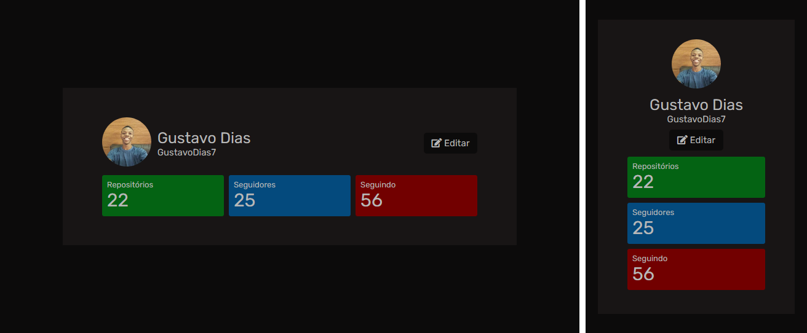

<br />
<p align="center">
    
    <h1 align="center">GitHub Profile</h1>
 <br />
</p>

## Descrição
- O intuito dessa aplicação, é pôr em prática meus conhecimentos em consumo de APIs utilizando o XMLHttpRequest() e fetch().
- Utilizei a API do GitHub para obter os dados de um determinado usuário, como o avatar, biografia, link do perfil, repositórios, número de seguidores e o número de pessoas seguidas. Tudo isso clicando em "Buscar" e escrevendo o "Login do Usuário".
- O principal material de estudo foi o livro Vanilla JS Pocket Guides (gomakethings).
- O design original desse projeto veio de um <a href="https://github.com/devchallenge-io/profile-component">desafio</a> da <a href="https://devchallenge.now.sh/">DevChallenge</a>.

## Demo
Acesse a <a href="https://gustavodias7.github.io/github-profile/" target="_blank">demonstração</a> do projeto.

## Techs: 
- HTML
- CSS
- JavaScript

## Download

Clone o repo
```sh
  git clone https://github.com/GustavoDias7/github-profile.git
```

## Licensa

Distribuído sob a licença MIT. Veja `LICENSE` para mais informações.

## Contatos
* <a href="https://www.linkedin.com/in/gustavo-dias-3100211b6/">Linkedin</a>
* <a href="https://www.instagram.com/eu.gustavodias/">Instagram</a>
* <a href="mailto:gustavo7dias@gmail.com">Email</a>