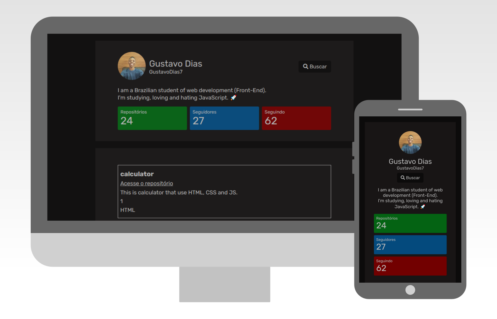

 

    
  

# Descrição
- O design original desse projeto veio de um dos <a href="https://github.com/devchallenge-io/profile-component">desafios</a> da <a href="https://devchallenge.now.sh/"> DevChallenge</a>.
- O intuito dessa atualização, é pôr em prática meus conhecimentos em consumo de APIs utilizando o XMLHttpRequest.
- Utilizei a API do GitHub para obter os dados de um determidado usuário, como a imagem do avatar, link do perfil, número de repositórios, número de seguidores e o número de pessoas seguidas. Tudo isso clicando em "Editar" e escrevendo o Login do Usuário.
- O principal material de estudo foi o livro Vanilla JS Pocket Guides (gomakethings).

# Demo
Acesse a <a href="https://gustavodias7.github.io/github-profile/" target="blank">demonstração</a>

# Techs: 
- HTML
- CSS
- JavaScript

# Comunidade DevChallenge
Site: https://www.devchallenge.com.br/  
Discord: https://discord.gg/yvYXhGj  